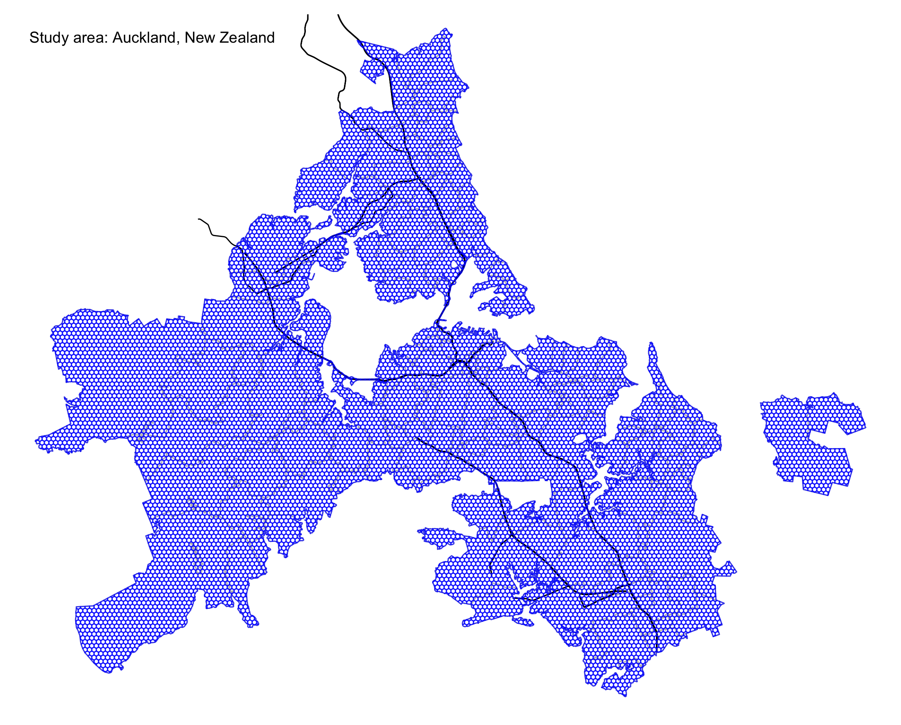
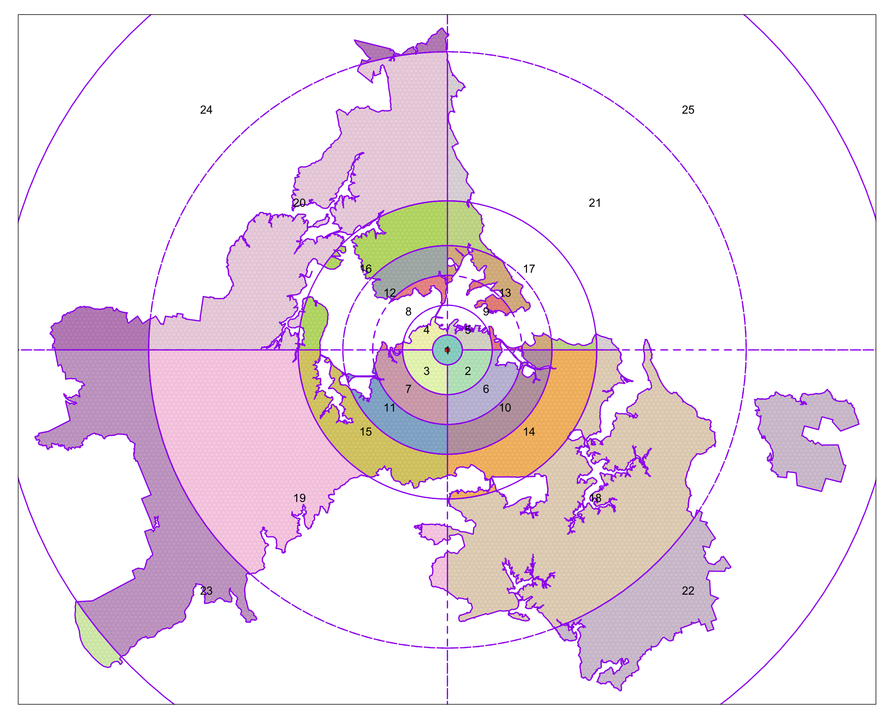

# Pre-request

## Import necessary packages
```{r, message=F, warning=F}
knitr::opts_chunk$set(echo = TRUE, warning = F, message = F, cache=TRUE, 
                      fig.width = 10, fig.height = 10)
library(tidyverse)
library(dplyr)
library(sf)
library(tmap)
library(here)
library(ggplot2)
library(RColorBrewer)
library(vegan) # diversity analysis
library(purrr) # parallel mapping 
library(DT)
```

# Data Preparation 

## Study area: Auckland city

Figure 1 represents the study area - Auckland city in New Zealand. 

```{r}
# New Zealand boundary
sf_akl <- read_sf(here("data/raw/auckland-boundary/auckland_boundary.shp"))

# New Zealand highway centrelines
highway_centrlines <- read_sf(here("data/raw/nz-state-highway-centrelines-SHP/nz-state-highway-centrelines.shp")) %>% 
  st_transform(crs = 2193) %>% # convert crs to New Zealand
  st_join(., sf_akl) %>% # spatial join with Auckland boundary
  filter(!is.na(city_name)) # remove highway centrelines that is not within Auckland city

# hexagonal grid cell
grids <- read_sf(here("data/raw/grids_shp/grids300.shp"), quiet = T) %>% 
  st_transform(crs = 2193)
```


```{r eval=F}
# create a map to overview the study area 
p_auckland <- tm_shape(sf_akl) +
    tm_borders(col = "grey") +
    tm_shape(highway_centrlines) +
    tm_lines() +
    tm_shape(grids) +
    tm_borders(col = "blue", alpha = 0.7) +
    tm_layout(frame = F, 
              title = "Study area: Auckland, New Zealand", 
              title.position = c("left", "top"), 
              title.size = 0.8) 
tmap_save(p_auckland, here("img/auckland.png"))
```



## Mobile location data of users

To help get sense of the mobile location data, I take 30 data points as examples and present them in Table 1. Each data point includes four attributes:

- `u_id`: the unique identifier for each user;
- `timestamp`: the specific time for each data point created;
- `grid_id`: the location for each data point created;
- `home`: the inferred home location of each user.


```{r}
# identified home locations 
identified_hms <- readRDS(here("data/raw/hm_hmlc.rds")) %>% 
  mutate(home = as.integer(home))

# mobile location data points of users 
df <- readRDS(here("data/raw/mobility_sample.rds")) %>% 
  sample_frac(size = 1)
 
# join home locations to users 
df <- df %>% left_join(., identified_hms, by = c("u_id" = "u_id"))
DT::datatable(df %>% head(30),
              options = list(pageLength = 5), 
              caption = "Table 1: Random examples of the mobile location data.")

# grid cells with data points 
considered_grid_cells <- df$grid_id %>% unique()
```


# Social Diversity Analysis

## Separate data with biweek interval

In order to compare the potential changes of diversity over time, the first step is to separate the data into multiple periods. I use a two-week interval and separate the data into 26 periods.

```{r eval=F}
# create break points of every two weeks 
biweekly_seqs <- seq(as.POSIXct("2020-01-01"), as.POSIXct("2020-12-31"), by = "2 weeks") %>%
  as.Date() 

# give each period a label, easier for subsequent analysis
prepare_labels <- function(index.start, index.end, weekly_seqs){
  start_day <- weekly_seqs[index.start] %>% format(., "%b %d")
  end_day <- weekly_seqs[index.end] %>% format(., "%b %d")
  paste(start_day, "-", end_day)
}
biweek_labels <- map2_chr(seq(1, 26, 1), seq(2, 27, 1), function(x, y) prepare_labels(x, y, biweekly_seqs))

# separate biweek data and store them 
get_biweekly_data <- function(df, biweek_labels, index.start, index.end){
  output <- df %>%
    mutate(date = as.Date(timestamp)) %>% 
    filter(date >= biweekly_seqs[index.start] & date < biweekly_seqs[index.end]) %>% 
    mutate(period = biweek_labels[index.start])
  saveRDS(output, file = paste0(here("data/derived/biweekly-data/biweek_"), index.start, ".rds"))
}

## if function: if all biweekly data files exist, do not need to re-run the get_biweekly_data fun
if(length(list.files(here("data/derived/biweekly-data"), pattern = "*.rds")) != 26){
  ## parallel mapping
  map2(seq(1, 26, 1), seq(2, 27, 1), function(x, y) get_biweekly_data(df, biweek_labels, x, y))
}
```

## Construct spatial sectors 

To operationalize diversity, one important step is to construct the spatial sectors. The dynamic sectors change along with grid cell locations is created based on different radius distance and directions [@chen_entangled_2021]. An example of spatial sectors of a grid cell is shown in Figure 2, where visitors visiting from the same sectors are considered as the same "species". The concept of "species" will be used in the subsequent diversity analysis. 

```{r}
# step 1: get centers of grid cells 
grid_centroids <- grids %>% 
  filter(grid_id %in% considered_grid_cells) %>% 
  st_centroid()
```

```{r}
# step 2: create buffers for each grid cell 
## buffer radius
radius <- c(1000, 3000, 5000, 7000, 10000, 20000, 30000, 60000)
## draw buffers 
draw_buffers <- function(df_centroids, radius, grid_index){
  grid_centroid <- df_centroids %>% filter(grid_id == grid_index)
  buffers <- list()
  for (i in 1:length(radius)){
    if(i == 1){
      buffers[[i]] <- grid_centroid %>% 
        st_buffer(., dist = radius[1]) %>% 
        mutate(radius = radius[1])
    } else{
      buffers[[i]] <- st_difference(
        grid_centroid %>% st_buffer(., dist = radius[i]),
        grid_centroid %>% st_buffer(., dist = radius[i-1])) %>% 
        dplyr::select(-grid_id.1) %>% 
        mutate(radius = radius[i])
    }
  }
  do.call(rbind, buffers)
}

##!!!note: this step takes more than 1 hour, the processed data is stored in `data/derived/` folder, which can be directly loaded. 
## process all grid cells 
if(file.exists(here("data/derived/grid_buffers.rds"))){
  grid_buffers <- readRDS(here("data/derived/grid_buffers.rds"))
}else{
  # parallel mapping 
  grid_buffers <- map_df(grid_centroids$grid_id, function(x) draw_buffers(grid_centroids, radius, x))
  saveRDS(grid_buffers, file = here("data/derived/grid_buffers.rds"))
}
```

```{r}
# step 3: cut buffers to create spatial sectors 
##cut single buffer
cut_buffer <- function(buffer, buffer_id, blades, grid_index){
  lwgeom::st_split(st_geometry(buffer[buffer_id, ]), blades) %>%
    st_collection_extract("POLYGON") %>%
    st_sf() %>%
    mutate(grid_id = grid_index) %>%
    dplyr::select(grid_id) 
}

get_cut_buffer <- function(df_centroids, df_buffers, shift, grid_index, crs = 2193){
  # get input grid centroid
  centroid <- df_centroids %>% 
    filter(grid_id == grid_index) %>% 
    st_coordinates() %>%
    as_tibble() %>%
    set_names(c("lon", "lat")) # convert geometry to lon and lat
  # create blades
  blades <- st_linestring(
    rbind(c(centroid$lon+shift, centroid$lat),
          c(centroid$lon-shift, centroid$lat),
          c(centroid$lon, centroid$lat),
          c(centroid$lon, centroid$lat+shift),
          c(centroid$lon, centroid$lat-shift))) %>%
    st_sfc(., crs = crs)
  # get buffer for input grid 
  buffer <- df_buffers %>% filter(grid_id == grid_index)
  buffer1 <- buffer[1, ] %>% dplyr::select(grid_id) 
  buffer <- buffer[-1, ] ## do not cut the first inner buffer
  buffer_ids <- 1:nrow(buffer)
  ## embed function within another function
  rbind(buffer1, do.call(rbind, map(buffer_ids, function(x) cut_buffer(buffer, x, blades, grid_index)))) %>%
    rowid_to_column(var = "sector_id") 
}

# process all grid cells 
if(file.exists(here::here("data/derived/grid_sectors.rds"))){
  grid_sectors <- readRDS(here::here("data/derived/grid_sectors.rds"))
}else{
  # parallel mapping 
  grid_sectors <-  map_df(grid_centroids$grid_id, function(x) get_cut_buffer(grid_centroids, grid_buffers, shift = 60000, x))
  saveRDS(grid_sectors, file = here::here("data/derived/grid_sectors.rds"))
}
```


```{r eval=F}
grid_sectors_example <- grid_sectors %>% 
  filter(grid_id == 15955) %>% 
  mutate(sector_id = factor(sector_id))

sectors_showcase <- grid_sectors_example %>% 
  st_intersection(grids, .) %>% 
  group_by(sector_id) %>% 
  summarise() 

p_sector_showcase <- tm_shape(grids) +
  tm_polygons(col = "white", alpha = 0.1, border.col = "grey") +
  tm_shape(sectors_showcase) +
  tm_polygons(col = "sector_id", border.col = "purple", alpha = 0.9) +
  tm_shape(grids %>% filter(grid_id == 15955)) +
  tm_polygons(col = "red") +  ## target grid 
  tm_shape(grid_sectors_example) +
  tm_borders(col = "purple", lty = 2) +
  tm_text(text = "sector_id", size = 0.6, col = "black") + 
  tm_layout(legend.show = FALSE)
tmap_save(p_sector_showcase, here("img/p_sector_showcase.png"))
```



## Analyze diversity 

After constructing spatial sectors for each grid cell, I apply the concept of biological diversity from ecology [@tramer_bird_1969; @maignan_bio-ecological_2003] and use Shannon's index ($H$) to measure the diversity. The Shannon's index is calculated as: 

$$H = -\sum_{i = 1}^{S}p_ilnp_i$$

where $p_i$ is the proportion of users that allied to "species" $i$ (i.e., sectors in this study) and $S$ is the frequency of "species". 

```{r eval=F}
## compute users in each visited grid
get_visitors_in_visited_grid <- function(users_in_grids, grid_index, grids, identified_hms){
  users <- users_in_grids %>% filter(grid_id == grid_index)
  users %>%
    left_join(., identified_hms) %>%
    na.omit() %>%
    rename(visited_grid = grid_id) %>%
    filter(home != grid_index) %>%  ##remove locals
    left_join(., grids, by = c("home" = "grid_id")) %>%
    rename(home_geometry = geometry) %>%
    st_as_sf(crs = 2193)
}

cal_diversity <- function(visitors_in_visited_grids, grid_sectors, sf_akl, grids, list_grids, index){
  ##visitors in the visited grid
  visitors_in_visited_grid <- visitors_in_visited_grids[[index]]

  if(nrow(visitors_in_visited_grid) == 0){
    output <- tibble()
  }else{
    ## visited grid id
    visited_grid <- unique(visitors_in_visited_grid$visited_grid)

    if(visited_grid %in% list_grids){
      ## remove locals
      visitors_in_visited_grid <- visitors_in_visited_grid %>%
        filter(home != visited_grid)

      ## sectors of the visited grid
      visited_grid_cutted_buffers <- grid_sectors %>% filter(grid_id == visited_grid)
      ## sectors within auckland
      ack_buffer_regions <- st_join(visited_grid_cutted_buffers, sf_akl) %>%
        na.omit() %>%
        dplyr::select(-id, -city_name) %>%
        unique()

      ## get visitors in each regions and remove the duplicates
      df_joined <- st_join(ack_buffer_regions, visitors_in_visited_grid) %>% na.omit()
      df_joined_drop_duplicates <- df_joined[!duplicated(df_joined$u_id), ]

      output <- df_joined_drop_duplicates %>%
        group_by(sector_id) %>%
        dplyr::summarise(n_user = n_distinct(u_id)) %>%
        ungroup() %>%
        mutate(area_km_square = as.numeric(st_area(.)/1000000)) %>%
        mutate(user_density_per_km = n_user/area_km_square) %>%
        st_set_geometry(NULL) %>%
        distinct(sector_id, user_density_per_km) %>%
        spread(sector_id, user_density_per_km) %>%
        diversity(index = "shannon") %>%
        tibble::enframe(name = NULL) %>%
        mutate(visited_grid = visited_grid) %>%
        dplyr::select(visited_grid, value) %>%
        dplyr::rename(div = value)
    }else{
      output <- tibble()
    }
  }
  return(output)
}

# calculate diversity 
cal_diversity_biweek <- function(file.nm, label.date_range){
  # get file path 
  file_to_read <- paste0(here("data/derived/biweekly-data/"), file.nm, ".rds")
  
  # read biweekly data 
  df <- readRDS(file_to_read)
  
  # grids with data records 
  grid_ids <- df$grid_id %>% unique()
  
  # distinct users in each grid 
  users_in_grids <- df %>% distinct(u_id, grid_id)
  
  # filter visitors in each grid cell, i.e., users whose home locations are not the same as the visited grid cells 
  message("Start aggregating visitors...")
  visitors_in_visited_grids <- map(grid_ids, function(x) get_visitors_in_visited_grid(users_in_grids, x, grids, identified_hms))
  message("Finish aggregating visitors!")
  
  # filter grid with at least 2 visitors
  list_grids <- do.call(bind_rows, visitors_in_visited_grids) %>%
    st_set_geometry(NULL) %>%
    group_by(visited_grid) %>%
    summarise(n = n_distinct(u_id)) %>%
    filter(n >= 2) %>% # filter grid with at least 2 visitors
    pull(visited_grid)
  
  # measure diversity
  message("Start calculating diveristy...") 
  diversity_shannon <- do.call(rbind, map(1:length(visitors_in_visited_grids), function(x) cal_diversity(visitors_in_visited_grids, grid_sectors, sf_akl, grids, list_grids, x)))
  # modify the diversity (normalize)
  diversity_shannon <-  diversity_shannon %>% 
      left_join(., grids, by = c("visited_grid" = "grid_id")) %>%
      st_as_sf() %>%
      st_transform(crs = 2193) %>% 
      mutate(norm_div = (div - min(div))/(max(div) - min(div)),
             norm_div = round(norm_div, 2), 
             date_range = label.date_range) %>% 
      dplyr::select(visited_grid, div, norm_div, date_range)
  message("Finish calculating diversity!")
  
  # save the result
  saveRDS(diversity_shannon, file = paste0(here("data/derived/biweekly-diversity/"), "div_", file.nm, ".rds"))
}

files <- paste0("biweek_", seq(1, 26, 1))
##!!note: this process takes around 5 hrs, the computed results are stored under `data/derived/biweekly-diversity` folder
map2(files, biweek_labels, purrrogress::with_progress(function(x, y) cal_diversity_biweek(file.nm = x, label.date_range = y)))
```


```{r}
# load computed diversity 
file_pathes <- paste0(here::here("data/derived/biweekly-diversity/"), "div_biweek_", seq(1, 26, 1), ".rds")
df_divs <- map(file_pathes, function(x) readRDS(x))
df_divs[[1]] %>% head()
```

```{r}
spatial_viz <- function(df_div, main.title_size = 1, legend.title_size = 0.5,  
                        legend.text_size = 0.35, legend_width = 0.5){
  range_biweek <- df_div$date_range %>% unique()
  tm_shape(sf_akl) +
      tm_borders(col = "grey") + 
      tm_shape(highway_centrlines) +
      tm_lines(col = "grey20", lwd = 2, alpha = 0.7) +
      tm_shape(df_div) +
      tm_fill("norm_div",
              palette = "OrRd",
              style = "fixed",
              breaks = c(0, 0.2, 0.4, 0.6, 0.8, 1.0),
              legend.is.portrait = T,
              legend.format = list(digits = 2),
              title = "Norm.Diversity") +
    tm_layout(main.title = paste0("Period: ", range_biweek),
              main.title.size = main.title_size,
              frame = FALSE,
              legend.frame = F,
              legend.bg.color = "white",
              legend.title.size = legend.title_size,
              legend.text.size = legend.text_size,
              legend.width = legend_width,
              legend.position = c("right", "top"))
}

pics_div <- map(df_divs, function(x) spatial_viz(x))
```


```{r}
p_map1to9 <- tmap_arrange(pics_div[1:3], nrow = 3, ncol = 3)
p_map1to9
```

<!-- ## Expected results -->

<!-- 1. The social diversity does change under the COVID-19 impacts.  -->
<!-- 2. The diversity around CDB may have a significant change.  -->
<!-- 3. Neighborhoods with relatively high diversity may have similar character(s) or certain urban functions.  -->
<!-- 4. The most dense place may not be the most diverse place. -->


# Results

<!-- [~200 words] -->

<!-- Tables and figures (maps and other graphics) are carefully planned to convey the results of your analysis. Intense exploration and evidence of many trials and failures. The author looked at the data in many different ways before coming to the final presentation of the data. -->

<!-- Show tables, plots, etc. and describe them. -->

```{r, fig.width=6, fig.height=3, fig.cap="Map of completely random data"}

```


```{r}

```

# Conclusions

<!-- [~200 words] -->

<!-- Clear summary adequately describing the results and putting them in context. Discussion of further questions and ways to continue investigation. -->

# References

<!-- All sources are cited in a consistent manner -->
